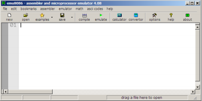

# Arquitectura
<h1>Emulador 8086
  <h2> 1.	Introducción

El emu8086 es un emulador del microprocesador 8086 (Intel o AMD compatible) con assembler integrado. A diferencia del entorno de programación en assembler utilizado anteriormente en la cátedra (MASM), este entorno corre sobre Windows y cuenta con una interfaz gráfica muy amigable e intuitiva que facilita el aprendizaje el leguaje de programación en assembler. 
  

  <h2> 2.	Utilización del entorno
    <h3> 2.1	Iniciar
     
 Para iniciar el entorno se deje ejecutar el archivo emu8086.exe que se encuentra en el directorio de instalación (ej. c:\emu8086).
       

     <h3> 2.2	Diferentes templantes
       
Luego de iniciar el entorno el emu8086 ofrece diferentes opciones: 
                                                                                                                                                      
• New: permite escribir un nuevo código en lenguaje ensamblador (“Código Fuente” con extensión .ASM) 
             
• Code examples: permite acceder a una serie de programas ejemplos muy útiles al momento de aprender a utilizar el                         entorno y la programación en assembler.
             
• Quick start tutor: llama al browser y permite explorar gran variedad de documentos de ayuda. 
             
 • Recent file: muestra los últimos archivos con los cuales se estuvo trabajando. En el caso de hacer click en New, el                      entorno ofrece trabajar con diferentes plantillas o templates:
                         

•	COM template (directiva #make_com#): es el formato más simple y antiguo de un archivo ejecutable, típicamente estos archivos se cargan con un offset de 100h (256 bytes). Por esta razón se debe agregar la directiva ORG 100h al comienzo del código para indicar la utilización de este tipo de archivos. Formato soportado por DOS y Windows Command Prompt.  

•	EXE template (directiva #make_exe#): este es el formato más avanzado de un archivo ejecutable. No tiene limitaciones en cuanto al tamaño del archivo y número de segmentos. Este template permite crear un programa exe simple con los segmentos de código, datos y pila predefinidos. Este tipo de archivo está soportado por Windows y Windows Command Prompt. El ensamblador elige automáticamente este tipo de archivo cuando encuentra definido un segmento de pila. 

•	BIN template (directiva #make_bin#): es un archivo ejecutable simple. Permite definir el valor de todos los registros, segmentos y el lugar de memoria donde se cargará a este programa. Cuando por ejemplo el ensamblador carga el archivo "MY.BIN" en el emulador buscará el archivo "MY.BINF" y cargará al archivo "MY.BIN" en la ubicación especificada en "MY.BINF", al igual que el valor inicial configurado para todos los registros. En el caso de que el emulador no encuentre al archivo "MY.BINF", se utilizará el valor actual de los registros al momento de la ejecución del .BIN y este código se ubicará en los valores que tengan en ese momento CS:IP. 

•	BOOT template (directiva #make_boot#): funciona igual de que un .BIN, pero utiliza valores predefinidos para ubicar el código y que coinciden con el primer track de un floppy disk (boot sector). La única diferencia con la directiva #make_bin# es que carga el código en la dirección predefinida 0000:7c00h. Este template permite emular el bootedo de una IBM PC desde el floppy disk.

<h3> 2.3	Ventana emulador.

A los fines de avanzar con los primeros pasos con el emu8086, en esto caso seleccionaremos la opción “empty                          workspace”. Luego de esto tendremos acceso a la ventana principal del emulador que cuenta con una barra de menú de Windows (file, edit, bookmarks, assembler, etc.) y varios botones de uso frecuente como New, Open, Save, Compile o Emulate. Esta ventana es en definitiva un editor de texto que permite crear y editar el código fuente de assembler.
                         

<h3> 2.4	Código de la suma de 2 números
  
  
<h3> 2.5	Emulate
 
 Al hacer clic en el en “Emulate”, se tendrá acceso a gran variedad de funciones e información y seleccionamos run:
   

<h3> 2.6 Compilamos nuestro ejercicio y mostramos a la pantalla:
  

  

                        
